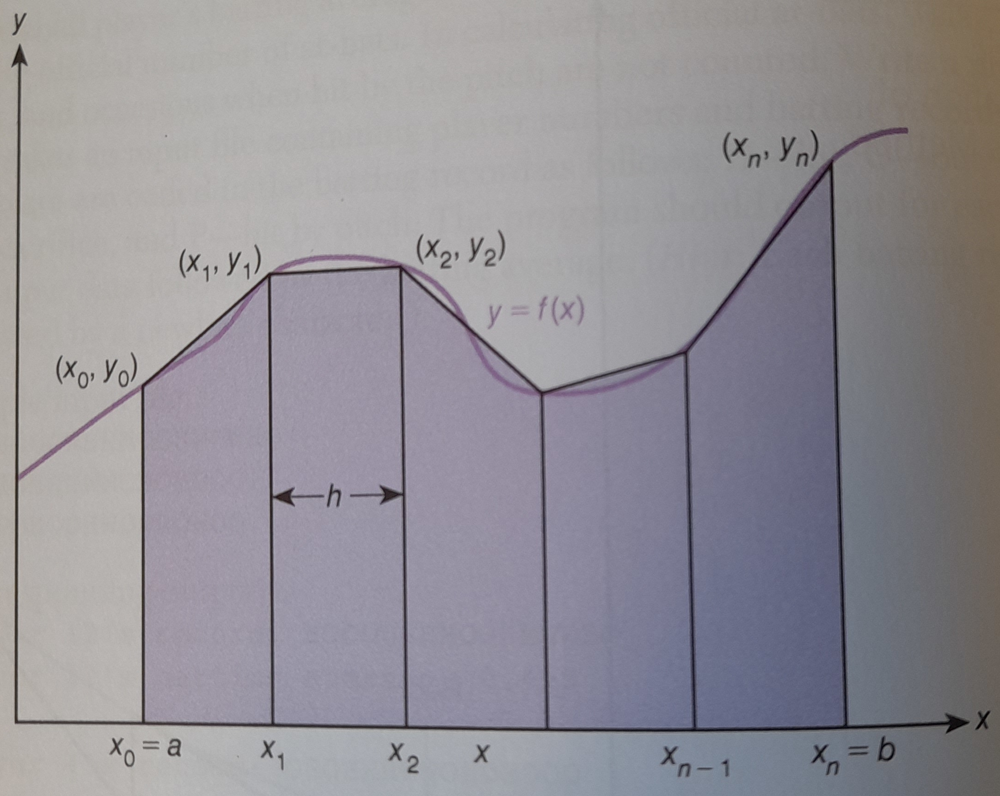

# IMPR Handin 3
## Ligefrem programmering af 'største fælles divisor' 

Opgave 17 side 334 i kapitel 5 i Problem Solving and Program Design in C, eighth edition. 

Se [Anders' noter og hints](https://people.cs.aau.dk/~andsch/IMPR/opgaver/noter-pspd7-334-17.html). 

Målet med denne aflevering er at opnå færdigheder i programmering af numeriske funktioner ud fra en given matematisk formel, 
samt at gennemføre udviklingen med top-down programmering ved trinvis forfinelse.

Opgave 17, side 334:
You would like to find the area under the curve 
```
y=f(x)
```
between the lines `x=a` and `x=b`. One way to approximate this area is to use line segments as 
approximations of small pieces of the curve and then sum the area of the trapezoids created by drawing perpendiculars 
from the line segment endpoints to the x-axis, as shown in Fig. 5.26.
We will assume that `f(x)` is non-negative over the interval `[a,b]`.
The trapezoidal rule approximates this area `T` as
```
T=(h/2)*(f(a) + f(b) + 2* (sum [i=1 ... n] f(x_i) )
```

for `n` subintervals of length `h`:
```
h = (b-a)/n
```

Write a function `trap` with input parameters `a`, `b`, `n`, and `f` that implements the trapezoidal rule.
Call `trap` with values for `n` of `2`, `4`, `8`, `16`, `32`, `64`, and `128` on functions
```
g(x) = x^2 sin(x) // a=0, b = 3.14159
```
and
```
h(x) = sqrt(4 - x^2) // a = -1, b = 2
```
Function `h` defines a half-circle of radius 2.
Compare your approximation to the actual area of this half-circle.

Fig. 5.26:
